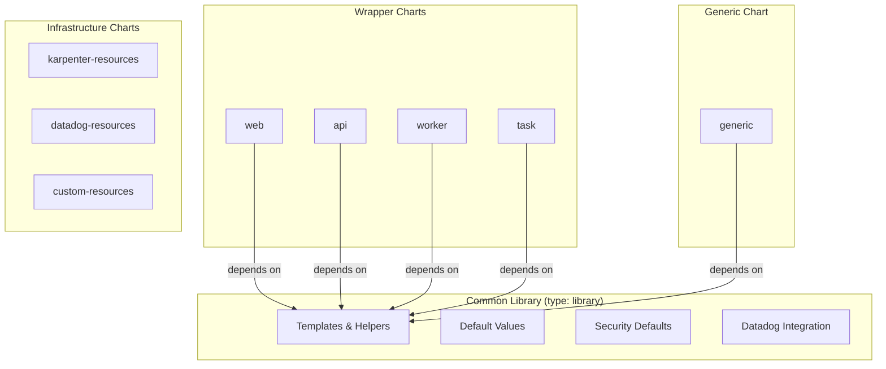
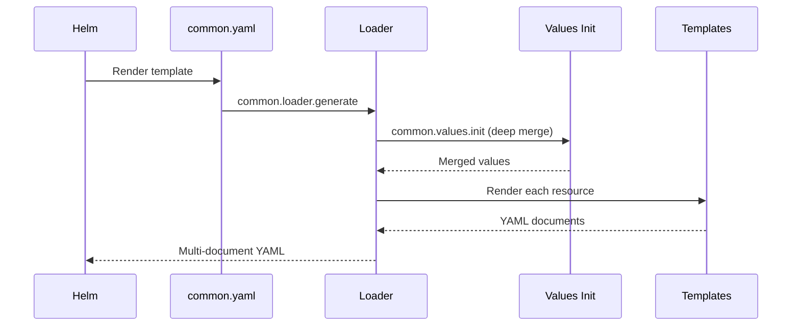

# Architecture

## Design Philosophy

The chart repository follows a **library + thin wrapper** pattern inspired by [bjw-s/helm-charts](https://github.com/bjw-s-labs/helm-charts):

1. A **common library chart** contains all template logic, security defaults, and helper functions
2. **Wrapper charts** (web, api, worker, task) provide opinionated defaults for specific workload types
3. The **generic chart** exposes the full power of the common library without opinions



## Template Organization

The common library organizes templates into three layers:

### 1. Helpers (`templates/lib/`)

Core functions used by all templates:

| Helper | Purpose |
|--------|---------|
| `_names.tpl` | Resource naming (fullname, chart, namespace) |
| `_labels.tpl` | Kubernetes labels, selectors, Datadog labels |
| `_image.tpl` | Image resolution with global registry support |
| `_security.tpl` | Pod and container security contexts |
| `_env.tpl` | Environment variables and common env vars |
| `_container.tpl` | Container and sidecar container specs |
| `_volumes.tpl` | Volume and volume mount generation |
| `_pod.tpl` | Unified pod template for all workload types |
| `_values.tpl` | Deep merge initialization |
| `_template.tpl` | Template utilities (tplValue, tplYaml) |

### 2. Resource Classes (`templates/classes/`)

One template per Kubernetes resource type:

```
classes/
├── config/          ConfigMap, Secret, ExternalSecret
├── workloads/       Deployment, CronJob, Job
├── networking/      Service, Ingress, NetworkPolicy, Gateway API
├── scaling/         HPA, PDB, VPA
├── rbac/            ServiceAccount, Role, RoleBinding
├── storage/         PersistentVolumeClaim
├── security/        Pod Security Standards
└── lifecycle/       Helm hooks
```

### 3. Loader (`templates/loader/`)

The `_generate.tpl` loader orchestrates rendering all resources through a single entry point:

```yaml
# Every wrapper chart has exactly one template file:
# templates/common.yaml
{{- include "common.loader.generate" . -}}
```

See [Common Library](common-library.md) and [Values Deep Merge](values-deep-merge.md) for details.

## Resource Flow

When Helm renders a chart, the flow is:


