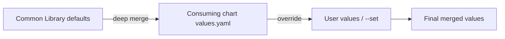

# Values Deep Merge

The common library uses a deep merge pattern to combine library defaults with consuming chart values. This eliminates nil pointer errors and provides a single source of truth for all default values.

## How It Works

When a chart depends on the common library, values are merged in this order:



The `common.values.init` template performs the merge:

```go
{{- define "common.values.init" -}}
  {{- if .Values.common -}}
    {{- $defaultValues := deepCopy .Values.common -}}
    {{- $userValues := deepCopy (omit .Values "common") -}}
    {{- $mergedValues := mustMergeOverwrite $defaultValues $userValues -}}
    {{- $_ := set . "Values" (deepCopy $mergedValues) -}}
  {{- end -}}
{{- end -}}
```

## Why Deep Merge?

Without deep merge, accessing nested values that don't exist in the consuming chart causes nil pointer errors:

```go
# This crashes if .Values.gateway doesn't exist:
{{- if .Values.gateway.httpRoute.enabled }}

# After deep merge, gateway always exists with defaults:
gateway:
  httpRoute:
    enabled: false
```

The common library's `values.yaml` defines **every key** that any template might access, with safe disabled defaults. This means:

- No nil pointer errors in templates
- No need for `{{- if and .Values.X .Values.X.enabled }}` guards everywhere
- Wrapper charts only need to override the values they care about

## Common Library Defaults

The common library provides defaults for all resource types:

```yaml
# charts/common/values.yaml (simplified)

# All disabled/empty by default
deploymentEnabled: true
replicas: 1
resources: {}
container:
  resources: {}

service:
  enabled: false
gateway:
  httpRoute:
    enabled: false
  grpcRoute:
    enabled: false
  # ... all routes disabled

hpa:
  enabled: false
podDisruptionBudget:
  enabled: false
networkPolicy:
  enabled: false

# Security enabled by default
security:
  defaultPodSecurityContext:
    runAsNonRoot: true
    runAsUser: 1000
    # ...
  defaultContainerSecurityContext:
    allowPrivilegeEscalation: false
    readOnlyRootFilesystem: true
    # ...

# Datadog enabled by default
datadog:
  enabled: true
commonEnvVars: true
```

## Wrapper Chart Overrides

A wrapper chart like `web` only sets the values that differ from common defaults:

```yaml
# charts/web/values.yaml - only the overrides
ports:
  - name: http
    containerPort: 8080

resources:
  requests:
    cpu: 100m
    memory: 128Mi

service:
  enabled: true  # Override: common default is false

gateway:
  httpRoute:
    enabled: true  # Override: common default is false
  targetGroupConfiguration:
    enabled: true
  loadBalancerConfiguration:
    enabled: true
    scheme: internet-facing
```

The final merged values contain everything from common plus the web overrides.
