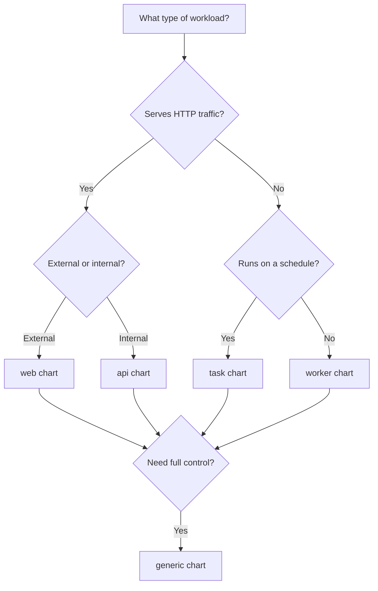

# Getting Started

This section covers everything you need to start deploying workloads with the DnD-IT Helm charts.

## Prerequisites

- Kubernetes 1.32+
- Helm 3.x
- Access to a Kubernetes cluster (Amazon EKS recommended)

## Steps

1. **[Install](installation.md)** the chart repository
2. **[Quick Start](quick-start.md)** with a minimal deployment
3. Pick the right chart for your workload type

## Which Chart Should I Use?

| Chart | When to use |
|-------|-------------|
| **web** | HTTP apps that need an external load balancer and Gateway API routing |
| **api** | Internal services that communicate over ClusterIP |
| **worker** | Long-running background processors (queue consumers, stream processors) |
| **task** | Scheduled jobs (CronJobs) like data pipelines, cleanup scripts |
| **generic** | When you need full control over every setting |
