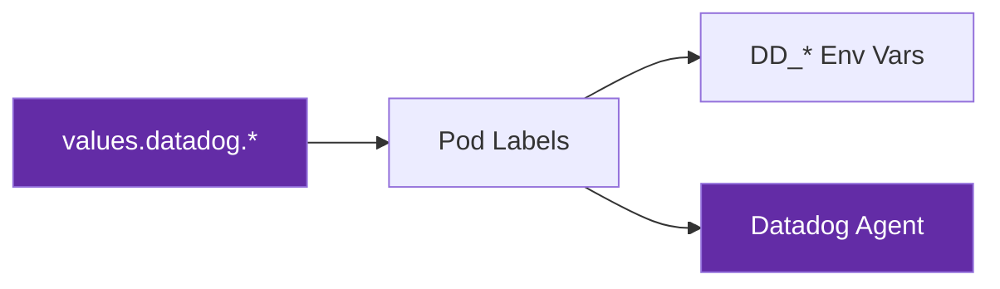

# Datadog Integration

All charts include [Datadog unified service tagging](https://docs.datadoghq.com/getting_started/tagging/unified_service_tagging/) out of the box. This provides consistent service identification across metrics, traces, and logs.

## How It Works

The integration follows a single source of truth pattern:



1. **Values** define service name, environment, and version
2. **Pod labels** are set from those values (`tags.datadoghq.com/*`)
3. **Environment variables** are injected via Kubernetes downward API from the pod labels
4. **Datadog Agent** reads the pod labels for automatic tagging

## Configuration

Datadog is **enabled by default**. The values with their fallback defaults:

```yaml
datadog:
  enabled: true
  service: ""    # Defaults to chart fullname (e.g., my-app)
  env: ""        # No default. Set explicitly (e.g., dev-titan, prod-titan). When empty,
                 # the tags.datadoghq.com/env label and DD_ENV env var are omitted.
  version: ""    # Defaults to image.tag (e.g., 1.0.0)
```

### Override Values

```yaml
datadog:
  service: "my-custom-service-name"
  env: "staging"
  version: "2.0.0-rc1"
```

## Pod Labels

When `datadog.enabled: true`, these labels are automatically added to **pod templates** (not to the Deployment/CronJob metadata):

```yaml
labels:
  admission.datadoghq.com/enabled: "true"
  tags.datadoghq.com/service: my-app
  tags.datadoghq.com/env: prod-titan     # only emitted when datadog.env is set
  tags.datadoghq.com/version: "1.0.0"
```

The labels are rendered via the `common.labels` helper with a `pod: true` parameter, ensuring they only appear on pod templates and not on parent resources. The `tags.datadoghq.com/env` label is omitted when `datadog.env` is empty, so pods do not silently inherit the release namespace as their environment tag.

## Environment Variables

When `commonEnvVars: true` (default) and `datadog.enabled: true`, these environment variables are injected via Kubernetes downward API:

```yaml
env:
  - name: DD_SERVICE
    valueFrom:
      fieldRef:
        fieldPath: metadata.labels['tags.datadoghq.com/service']
  # DD_ENV is only injected when datadog.env is set
  - name: DD_ENV
    valueFrom:
      fieldRef:
        fieldPath: metadata.labels['tags.datadoghq.com/env']
  - name: DD_VERSION
    valueFrom:
      fieldRef:
        fieldPath: metadata.labels['tags.datadoghq.com/version']
  - name: DD_AGENT_HOST
    valueFrom:
      fieldRef:
        fieldPath: status.hostIP
  - name: DD_ENTITY_ID
    valueFrom:
      fieldRef:
        fieldPath: metadata.uid
```

This approach means the env vars always reflect the actual pod labels, keeping everything in sync.

## Disabling Datadog

```yaml
datadog:
  enabled: false
```

This removes:

- All `tags.datadoghq.com/*` pod labels
- The `admission.datadoghq.com/enabled` label
- All `DD_*` environment variables
