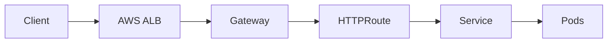

# Gateway API

The charts use [Gateway API](https://gateway-api.sigs.k8s.io/) with [AWS Load Balancer Controller v3](https://kubernetes-sigs.github.io/aws-load-balancer-controller/) instead of Ingress for traffic routing.

## Overview

Gateway API is the successor to Ingress in Kubernetes. It provides a more expressive, role-oriented API for routing traffic:



Three AWS LBC custom resources configure the ALB:

| Resource | Purpose |
|----------|---------|
| **LoadBalancerConfiguration** | ALB settings (scheme, IP type, security groups) |
| **TargetGroupConfiguration** | Target group settings (type, health checks) |
| **HTTPRoute** | Routing rules (host, path, backend) |

## Web Chart (Default)

The web chart has Gateway API enabled by default:

```yaml
gateway:
  httpRoute:
    enabled: true
    parentRefs:
      - name: public-gateway
        namespace: gateway-system
    hostnames:
      - myapp.example.com
    rules:
      - matches:
          - path:
              type: PathPrefix
              value: /
        backendRefs:
          - name: my-web-app
            port: 80

  targetGroupConfiguration:
    enabled: true
    defaultConfiguration:
      targetType: ip
      healthCheckConfig:
        healthCheckPath: /readyz
        healthCheckPort: "8080"

  loadBalancerConfiguration:
    enabled: true
    scheme: internet-facing
```

## Internal Services

For internal services (formerly the `api` chart use case), use the web chart with `internal` scheme:

```yaml
gateway:
  httpRoute:
    enabled: true
    parentRefs:
      - name: internal-gateway
        namespace: gateway-system
    hostnames:
      - api.internal.example.com

  targetGroupConfiguration:
    enabled: true

  loadBalancerConfiguration:
    enabled: true
    scheme: internal
```

!!! note
    Use the `web` chart for both internal and external HTTP services.

## Supported Route Types

| Route | API Version | Status |
|-------|-------------|--------|
| HTTPRoute | `gateway.networking.k8s.io/v1` | Stable |
| GRPCRoute | `gateway.networking.k8s.io/v1` | Stable |
| TCPRoute | `gateway.networking.k8s.io/v1alpha2` | Experimental |
| TLSRoute | `gateway.networking.k8s.io/v1alpha2` | Experimental |
| UDPRoute | `gateway.networking.k8s.io/v1alpha2` | Experimental |

All route types are capability-guarded - they only render when the cluster has the corresponding CRD installed.

## GRPCRoute Example

```yaml
gateway:
  grpcRoute:
    enabled: true
    parentRefs:
      - name: grpc-gateway
        namespace: gateway-system
    hostnames:
      - grpc.example.com
    rules:
      - matches:
          - method:
              service: myservice.v1.MyService
        backendRefs:
          - name: my-grpc-service
            port: 50051
```

## LoadBalancerConfiguration Options

```yaml
gateway:
  loadBalancerConfiguration:
    enabled: true
    scheme: internet-facing         # or internal
    ipAddressType: ipv4             # or dualstack
    loadBalancerSubnets: []         # Auto-discovered if empty
    securityGroups: []              # Auto-discovered if empty
    sourceRanges: []                # CIDR restrictions
    tags:
      Environment: production
    loadBalancerAttributes:
      - key: idle_timeout.timeout_seconds
        value: "60"
```

## TargetGroupConfiguration Options

```yaml
gateway:
  targetGroupConfiguration:
    enabled: true
    defaultConfiguration:
      targetType: ip                # or instance
      protocolVersion: HTTP1        # or HTTP2, GRPC
      healthCheckConfig:
        healthCheckPath: /readyz
        healthCheckPort: "8080"
        healthCheckProtocol: HTTP
        healthCheckIntervalSeconds: 15
        healthCheckTimeoutSeconds: 5
        healthyThresholdCount: 2
        unhealthyThresholdCount: 3
```

## Migration from Ingress

If migrating from the old Ingress-based configuration:

| Ingress Annotation | Gateway API Equivalent |
|--------------------|----------------------|
| `alb.ingress.kubernetes.io/scheme` | `loadBalancerConfiguration.scheme` |
| `alb.ingress.kubernetes.io/target-type` | `targetGroupConfiguration.defaultConfiguration.targetType` |
| `alb.ingress.kubernetes.io/healthcheck-path` | `targetGroupConfiguration.defaultConfiguration.healthCheckConfig.healthCheckPath` |
| `alb.ingress.kubernetes.io/listen-ports` | `loadBalancerConfiguration.listenerConfigurations` |
| Host/path rules in `ingress.hosts` | `httpRoute.hostnames` and `httpRoute.rules` |

!!! info "Ingress Still Supported"
    The common library still includes the Ingress template for backward compatibility. Both Ingress and Gateway API can coexist during migration.
