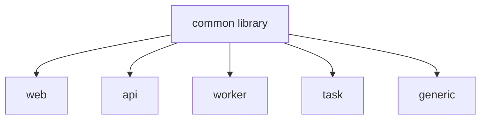

# Helm Charts

Production-ready, opinionated Helm charts for deploying workloads on Amazon EKS.

## What You Get

- **Opinionated charts** for web apps, APIs, workers, and scheduled tasks
- **Secure by default** with non-root containers, read-only filesystems, and dropped capabilities
- **Datadog integration** with unified service tagging out of the box
- **Gateway API** support with AWS Load Balancer Controller v3
- **Pod-level resources** (Kubernetes 1.32+) as the default resource model

---

## Choose Your Chart

| Chart | Use Case | Service | Gateway |
|-------|----------|---------|---------|
| [**web**](charts/web.md) | External-facing HTTP applications | :material-check: | :material-check: |
| [**api**](charts/api.md) | Internal API services | :material-check: | :material-close: |
| [**worker**](charts/worker.md) | Background processing | :material-close: | :material-close: |
| [**task**](charts/task.md) | Scheduled CronJobs | :material-close: | :material-close: |
| [**generic**](charts/generic.md) | Full control, any workload type | Configurable | Configurable |

[:octicons-arrow-right-24: Getting Started](getting-started/index.md){ .md-button }

---

## Architecture

All charts are built on a shared **common library** that provides secure defaults, Datadog integration, and consistent templating. The thin wrapper charts (web, api, worker, task) add opinionated defaults on top.

[:octicons-arrow-right-24: Architecture Deep Dive](architecture/index.md){ .md-button }

---

## Quick Links

- :material-github: [GitHub Repository](https://github.com/dnd-it/helm-charts)
- :material-book-open-variant: [Values Reference](reference/values.md)
- :material-shield-check: [Security Defaults](guides/security.md)
- :material-test-tube: [Contributing & Testing](contributing/index.md)
